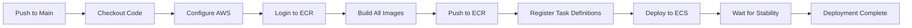

# WatchTower 🚀

> A comprehensive cloud monitoring solution for microservices applications deployed on AWS ECS Fargate with automated CI/CD and infrastructure as code.

[](https://aws.amazon.com/ecs/)
[](https://www.terraform.io/)
[](https://prometheus.io/)
[](https://grafana.com/)

## 📋 Table of Contents

- [Overview](#overview)
- [Architecture](#architecture)
- [Features](#features)
- [Tech Stack](#tech-stack)
- [Project Structure](#project-structure)
- [Prerequisites](#prerequisites)
- [Getting Started](#getting-started)
- [CI/CD Pipeline](#cicd-pipeline)
- [Monitoring Stack](#monitoring-stack)
- [Infrastructure](#infrastructure)
- [Lessons Learned](#lessons-learned)
- [Future Improvements](#future-improvements)
- [Contributing](#contributing)
- [License](#license)

---

## 🎯 Overview

**WatchTower** is a production-ready monitoring and deployment solution that automatically monitors metrics from a multi-microservice e-commerce application. The project demonstrates modern DevOps practices including containerization, infrastructure as code, continuous deployment, and comprehensive observability.

This project showcases:
- ✅ Automated deployment of 9 microservices to AWS ECS Fargate
- ✅ Complete observability stack with Prometheus and Grafana
- ✅ Infrastructure as Code using Terraform
- ✅ CI/CD pipeline with GitHub Actions
- ✅ Multi-container task architecture
- ✅ Custom metrics instrumentation

---

## 🏗️ Architecture

### High-Level Architecture

```
┌─────────────────────────────────────────────────────────────┐
│                         AWS Cloud                            │
│                                                              │
│  ┌────────────────────────────────────────────────────┐    │
│  │              Application Load Balancer              │    │
│  └───────────────────┬────────────────────────────────┘    │
│                      │                                       │
│  ┌───────────────────▼───────────────────────────────┐     │
│  │              ECS Cluster (Fargate)                 │     │
│  │                                                     │     │
│  │  ┌─────────────────────────────────────────────┐  │     │
│  │  │         Main Task (10 Containers)           │  │     │
│  │  │  ┌──────────┐  ┌──────────┐  ┌──────────┐  │  │     │
│  │  │  │ Frontend │  │   Cart   │  │  Email   │  │  │     │
│  │  │  └──────────┘  └──────────┘  └──────────┘  │  │     │
│  │  │  ┌──────────┐  ┌──────────┐  ┌──────────┐  │  │     │
│  │  │  │ Payment  │  │ Checkout │  │ Shipping │  │  │     │
│  │  │  └──────────┘  └──────────┘  └──────────┘  │  │     │
│  │  │  ┌──────────┐  ┌──────────┐  ┌──────────┐  │  │     │
│  │  │  │ Product  │  │ Currency │  │  Recom.  │  │  │     │
│  │  │  └──────────┘  └──────────┘  └──────────┘  │  │     │
│  │  │  ┌──────────┐                              │  │     │
│  │  │  │Prometheus│  ← Scrapes metrics          │  │     │
│  │  │  └──────────┘                              │  │     │
│  │  └─────────────────────────────────────────────┘  │     │
│  │                                                     │     │
│  │  ┌─────────────────────────────────────────────┐  │     │
│  │  │         Grafana Task (Separate)             │  │     │
│  │  │  ┌──────────┐                               │  │     │
│  │  │  │ Grafana  │  ← Queries Prometheus        │  │     │
│  │  │  └──────────┘                               │  │     │
│  │  └─────────────────────────────────────────────┘  │     │
│  └─────────────────────────────────────────────────┘     │
│                                                           │
│  ┌────────────────┐  ┌────────────────┐                 │
│  │      ECR        │  │   CloudWatch   │                 │
│  │ (Docker Images)│  │     Logs       │                 │
│  └────────────────┘  └────────────────┘                 │
└───────────────────────────────────────────────────────────┘

         ▲                                    ▲
         │                                    │
    ┌────┴─────┐                        ┌────┴─────┐
    │ GitHub   │                        │Terraform │
    │ Actions  │                        │   IaC    │
    │  CI/CD   │                        │          │
    └──────────┘                        └──────────┘
```

### Container Distribution

**Main Task (10 containers - ECS limit):**
1. Frontend (Go)
2. Email Service (Python)
3. Checkout Service (Go)
4. Shipping Service (Go)
5. Recommendation Service (Python)
6. Cart Service (C#)
7. Currency Service (Node.js)
8. Product Catalog Service (Go)
9. Payment Service (Node.js)
10. Prometheus (Monitoring)

**Grafana Task (Separate):**
- Grafana (Visualization)

> **Note:** Grafana is in a separate task because AWS ECS Fargate has a 10-container limit per task. In a production environment, each microservice would ideally have its own task for better isolation and scalability.

---

## ✨ Features

### Core Features
- **Automated Deployment:** Push to main branch triggers automatic build and deployment
- **Real-time Monitoring:** Prometheus scrapes metrics from instrumented services
- **Visual Dashboards:** Grafana provides beautiful, customizable dashboards
- **Infrastructure as Code:** Entire AWS infrastructure defined in Terraform
- **Multi-Service Architecture:** 9 microservices working together
- **Container Orchestration:** AWS ECS Fargate manages containerized services
- **Custom Metrics:** Frontend and checkout services expose Prometheus metrics
- **Health Checks:** ALB and ECS perform automated health checks
- **Centralized Logging:** CloudWatch Logs aggregates logs from all services

### DevOps Practices
- ✅ Continuous Integration/Continuous Deployment (CI/CD)
- ✅ Infrastructure as Code (IaC)
- ✅ Containerization
- ✅ Observability & Monitoring
- ✅ Automated Testing & Deployment
- ✅ Security Groups & Network Isolation
- ✅ Load Balancing
- ✅ Service Discovery

---

## 🛠️ Tech Stack

### Cloud & Infrastructure
- **AWS ECS Fargate** - Serverless container orchestration
- **AWS ECR** - Container registry
- **Application Load Balancer** - Traffic distribution
- **VPC & Subnets** - Network isolation
- **Security Groups** - Firewall rules
- **CloudWatch Logs** - Centralized logging
- **Terraform** - Infrastructure as Code

### Monitoring & Observability
- **Prometheus** - Metrics collection and storage
- **Grafana** - Metrics visualization and dashboards
- **CloudWatch** - AWS native monitoring

### CI/CD
- **GitHub Actions** - Automated build and deployment pipeline
- **Docker** - Containerization

### Application Services (Polyglot Microservices)
- **Go** - Frontend, Checkout, Shipping, Product Catalog
- **Python** - Email, Recommendation
- **Node.js** - Currency, Payment
- **C#/.NET** - Cart Service

---

## 📁 Project Structure

```
WatchTower/
├── .github/
│   └── workflows/
│       ├── deploy.yml              # Main deployment workflow
│       └── deploy-grafana.yml      # Grafana deployment workflow
├── microservices-demo/
│   └── src/
│       ├── frontend/
│       │   ├── Dockerfile
│       │   └── main.go            # With Prometheus instrumentation
│       ├── cartservice/
│       ├── checkoutservice/
│       │   ├── Dockerfile
│       │   └── main.go            # With Prometheus instrumentation
│       ├── currencyservice/
│       ├── emailservice/
│       ├── paymentservice/
│       ├── productcatalogservice/
│       ├── recommendationservice/
│       └── shippingservice/
├── prometheus/
│   ├── Dockerfile
│   └── prometheus.yml             # Scrape configuration
├── grafana/
│   └── ecs/
│       └── task-def.json          # Grafana task definition
├── ecs/
│   ├── task-def.json              # Main task definition (template)
│   └── task-def-template.json
├── terraform/
│   ├── main.tf
│   ├── vpc.tf
│   ├── ecs.tf
│   ├── alb.tf
│   ├── ecr.tf
│   └── variables.tf
└── README.md
```

---

## 📋 Prerequisites

Before you begin, ensure you have:

- **AWS Account** with appropriate permissions
- **Terraform** (v1.0+) installed
- **Docker** installed and running
- **AWS CLI** configured with credentials
- **Git** installed
- **GitHub Account** for CI/CD

### Required AWS Permissions
- ECS (create clusters, services, tasks)
- ECR (create repositories, push images)
- VPC (create VPCs, subnets, security groups)
- ALB (create load balancers, target groups)
- IAM (create roles and policies)
- CloudWatch (create log groups)

---

## 🚀 Getting Started

### 1. Clone the Repository

```bash
git clone https://github.com/DivineObido/WatchTower.git
cd WatchTower
```

### 2. Set Up AWS Infrastructure

```bash
cd terraform

# Initialize Terraform
terraform init

# Review the plan
terraform plan

# Apply infrastructure
terraform apply
```

This creates:
- VPC with public/private subnets
- ECS Cluster
- Application Load Balancer
- Target Groups
- Security Groups
- ECR Repository
- IAM Roles

### 3. Configure GitHub Secrets

Add these secrets to your GitHub repository (Settings → Secrets and variables → Actions):

```
AWS_ACCESS_KEY_ID=<your-access-key>
AWS_SECRET_ACCESS_KEY=<your-secret-key>
```

### 4. Configure GitHub Variables

Add these variables (Settings → Secrets and variables → Actions → Variables):

```
AWS_REGION=us-east-1
ECS_CLUSTER=watchTower-ecs-cluster
ECS_SERVICE=watchTower-ecs-service
ECR_REPOSITORY=watchtower-repo
GRAFANA_ECS_SERVICE=grafana-ecs-service
```

### 5. Deploy the Application

Push to the main branch to trigger automatic deployment:

```bash
git add .
git commit -m "Initial deployment"
git push origin main
```

GitHub Actions will:
1. Build all Docker images
2. Push images to ECR
3. Register ECS task definitions
4. Deploy to ECS
5. Wait for service stability

### 6. Access the Application

After deployment completes:

```bash
# Get ALB DNS name
terraform output alb_dns_name

# Or via AWS CLI
aws elbv2 describe-load-balancers \
  --query 'LoadBalancers[0].DNSName' \
  --output text
```

Open the ALB DNS in your browser to access the application.

### 7. Access Grafana

```bash
# Get Grafana task IP
GRAFANA_TASK=$(aws ecs list-tasks \
  --cluster watchTower-ecs-cluster \
  --service-name grafana-ecs-service \
  --query 'taskArns[0]' \
  --output text)

GRAFANA_IP=$(aws ecs describe-tasks \
  --cluster watchTower-ecs-cluster \
  --tasks $GRAFANA_TASK \
  --query 'tasks[0].attachments[0].details[?name==`privateIPv4Address`].value' \
  --output text)

echo "Grafana URL: http://$GRAFANA_IP:3000"
```

**Default credentials:**
- Username: `admin`
- Password: `admin`

---

## 🔄 CI/CD Pipeline

### Workflow Overview

The GitHub Actions pipeline automates the entire deployment process:



### Pipeline Steps

1. **Trigger:** Push to `main` branch
2. **Build:** Builds Docker images for all 10 services
3. **Push:** Pushes images to Amazon ECR
4. **Register:** Registers updated task definitions
5. **Deploy:** Updates ECS services with new task definitions
6. **Verify:** Waits for services to reach stable state

### Key Features
- ✅ Parallel image building for faster deployments
- ✅ Automatic rollback on failure
- ✅ Health check validation
- ✅ Zero-downtime deployments
- ✅ Separate workflows for main app and Grafana

---

## 📊 Monitoring Stack

### Prometheus Configuration

Prometheus scrapes metrics from instrumented services every 30 seconds:

**Instrumented Services:**
- **Frontend** (`localhost:8080/metrics`)
  - `frontend_http_requests_total` - Total HTTP requests
  - `frontend_http_request_duration_seconds` - Request duration histogram
  
- **Checkout Service** (`localhost:9091/metrics`)
  - `checkout_requests_total` - Total checkout requests
  - `checkout_errors_total` - Failed checkouts
  - `checkout_duration_seconds` - Checkout duration histogram

**Configuration:** [`prometheus/prometheus.yml`](prometheus/prometheus.yml)

### Grafana Dashboards

Access Grafana to visualize metrics:

1. **Connect Prometheus Data Source:**
   - Configuration → Data Sources → Add Prometheus
   - URL: `http://<main-task-ip>:9090`
   - Save & Test

2. **Sample Queries:**
   ```promql
   # Service uptime
   up
   
   # Frontend request rate
   rate(frontend_http_requests_total[5m])
   
   # Checkout error rate
   rate(checkout_errors_total[5m])
   
   # Request duration (95th percentile)
   histogram_quantile(0.95, rate(frontend_http_request_duration_seconds_bucket[5m]))
   ```

3. **Import Pre-built Dashboards:**
   - Prometheus 2.0 Stats (ID: 3662)
   - Node Exporter Full (ID: 1860)

### Adding Metrics to Other Services

To instrument additional services:

**Go Services:**
```go
import (
    "github.com/prometheus/client_golang/prometheus"
    "github.com/prometheus/client_golang/prometheus/promhttp"
)

// Define metrics
var requestCounter = prometheus.NewCounter(...)

// Register metrics
prometheus.MustRegister(requestCounter)

// Expose endpoint
http.Handle("/metrics", promhttp.Handler())
```

**Python Services:**
```python
from prometheus_client import Counter, Histogram, start_http_server

# Define metrics
request_counter = Counter('requests_total', 'Total requests')

# Expose endpoint
start_http_server(8000)
```

---

## 🏗️ Infrastructure

### AWS Resources Created

**Networking:**
- 1 VPC (10.0.0.0/16)
- 2 Public Subnets (across 2 AZs)
- 1 Internet Gateway
- Route Tables

**Compute:**
- 1 ECS Cluster (Fargate)
- 2 ECS Services (main app + Grafana)
- 2 Task Definitions

**Load Balancing:**
- 1 Application Load Balancer
- 2 Target Groups (app + Grafana)
- Health checks configured

**Storage:**
- 1 ECR Repository
- CloudWatch Log Groups

**Security:**
- Security Groups for ALB, ECS, Grafana
- IAM Roles for ECS Task Execution

### Cost Estimation

**Monthly costs (approximate):**
- ECS Fargate Tasks: ~$50-80
- Application Load Balancer: ~$20
- Data Transfer: ~$10
- CloudWatch Logs: ~$5
- **Total:** ~$85-115/month

> **Tip:** Use AWS Free Tier where applicable to reduce costs.

---

## 💡 Lessons Learned

### Challenges & Solutions

1. **ECS 10-Container Limit**
   - **Challenge:** Needed 11 containers (10 services + Prometheus + Grafana)
   - **Solution:** Split into 2 tasks - main task with 10 containers, separate Grafana task
   - **Production Approach:** Each service should have its own task for better isolation

2. **Service Discovery Between Tasks**
   - **Challenge:** Grafana (separate task) couldn't reach Prometheus via Cloud Map DNS
   - **Solution:** Used private IP address for inter-task communication
   - **Production Approach:** Implement AWS Cloud Map or internal ALB for stable endpoints

3. **Port Conflicts**
   - **Challenge:** Multiple services trying to use the same ports
   - **Solution:** Carefully mapped unique ports for each service
   - **Learning:** Always document port assignments clearly

4. **GitHub Actions Image Building**
   - **Challenge:** Building 10 images sequentially was slow
   - **Solution:** Optimized workflow with proper caching
   - **Future:** Implement parallel builds for faster deployments

5. **Prometheus Scrape Configuration**
   - **Challenge:** Initially used service names instead of `localhost`
   - **Solution:** All containers in same task must communicate via `localhost`
   - **Learning:** Understand ECS networking models (bridge vs awsvpc)

---

## 🚀 Future Improvements

### Short Term
- [ ] Add metrics instrumentation to remaining services
- [ ] Implement persistent storage for Grafana (EFS)
- [ ] Create custom Grafana dashboards
- [ ] Add alerting rules in Prometheus
- [ ] Implement log aggregation and analysis

### Medium Term
- [ ] Split each service into separate ECS tasks
- [ ] Implement AWS Cloud Map for service discovery
- [ ] Add internal ALB for inter-service communication
- [ ] Implement auto-scaling policies
- [ ] Add SSL/TLS certificates
- [ ] Implement AWS Secrets Manager for sensitive data

### Long Term
- [ ] Migrate to EKS for Kubernetes orchestration
- [ ] Implement distributed tracing (AWS X-Ray/Jaeger)
- [ ] Add CI/CD testing stages
- [ ] Implement blue-green deployments
- [ ] Add cost optimization with Spot instances
- [ ] Implement disaster recovery and backups

---

## 🤝 Contributing

Contributions are welcome! Please follow these steps:

1. Fork the repository
2. Create a feature branch (`git checkout -b feature/AmazingFeature`)
3. Commit your changes (`git commit -m 'Add some AmazingFeature'`)
4. Push to the branch (`git push origin feature/AmazingFeature`)
5. Open a Pull Request

### Contribution Guidelines
- Follow existing code style
- Update documentation for any new features
- Add tests where applicable
- Ensure all workflows pass before submitting PR

---

## 📝 License

This project is licensed under the MIT License - see the [LICENSE](LICENSE) file for details.

---

## 🙏 Acknowledgments

- **Base Application:** Forked from [Google Cloud Platform's Microservices Demo](https://github.com/GoogleCloudPlatform/microservices-demo)
- **Monitoring Tools:** Prometheus and Grafana communities
- **Cloud Platform:** AWS for ECS Fargate capabilities
- **CI/CD:** GitHub Actions for seamless automation

---

## 📧 Contact

**Divine Obido**
- GitHub: [@DivineObido](https://github.com/DivineObido)
- Project Link: [https://github.com/DivineObido/WatchTower](https://github.com/DivineObido/WatchTower)

---

## 📸 Screenshots

### Application Dashboard


### Grafana Monitoring


### Prometheus Targets


### AWS ECS Console


---

**⭐ If you found this project helpful, please consider giving it a star!**
